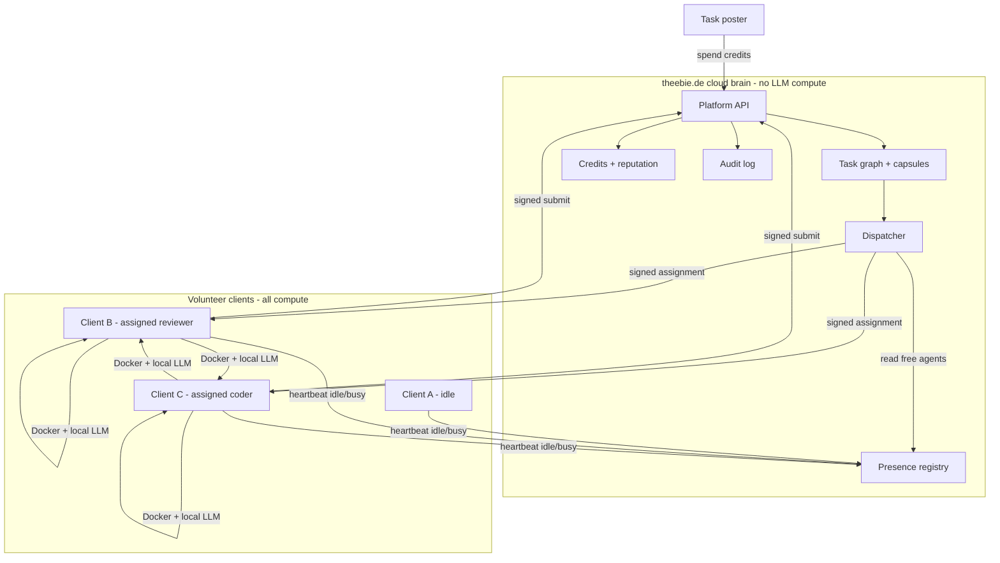

# ROADMAP_CHANGES — Volunteer Client & Central Assignment (Phase 6+)

**Status:** Proposed (design handoff)  
**Date:** 2026-06-15  
**Audience:** Next implementation round (Composer / agents)  
**Authoritative spec:** [ROADMAP.md](ROADMAP.md) remains the long-term product vision. **This document defines a deliberate pivot/extension** for mass-market volunteer compute. When implemented, merge accepted parts back into `ROADMAP.md` §17 and add ADR 0005.

---

## How to use this document

1. Read **Non-negotiables** and **Current baseline** first.
2. Implement packages **P6.0 → P6.N in order** (see [Implementation packages](#implementation-packages-p60)).
3. Do not remove Phases 0–4 code paths until assignment mode is feature-flagged and tested.
4. For a Composer session, paste the [Composer kickoff prompt](#composer-kickoff-prompt) at the bottom.

**Related docs today:**

| Doc | Role |
|-----|------|
| [ROADMAP.md](ROADMAP.md) | Original BOINC-inspired vision |
| [docs/execution-plan.md](docs/execution-plan.md) | P0–P5 packages (P0–P4 done) |
| [docs/status.md](docs/status.md) | Checkbox tracker |
| [docs/credibility-spec.md](docs/credibility-spec.md) | Reputation math (extend for credits) |
| [docs/deploy.md](docs/deploy.md) | theebie.de static pilot + VPS notes |
| Live pilot | https://theebie.de/sites/agentswarm/ |

---

## Executive summary

AgentSwarm Phases **0–4 are implemented**: REST task pool, credibility, planner/orchestrator/moderator, federation, deploy sign-offs, demos, CI.

The **next product direction** is a **SETI@home / BOINC-style volunteer client**:

- **Compute runs only on participant machines** (local LLM + sandbox). theebie.de does **not** run inference.
- **theebie.de runs a small “cloud brain”**: presence registry, task graph, **central assignment**, policy, audit, credits/reputation.
- **Clients cannot pick tasks or roles.** They heartbeat as idle; the dispatcher **assigns** encapsulated work.
- **No self-spawned helpers.** If a project needs a reviewer/coder/tester, the platform issues `pool.need(role)` and assigns a **different** client/owner.
- **Tasks include subjective work** (poems, “nice website”) verified by **multiple powerful LLM reviewers** with rubrics and quorum — not only pytest/objective checks.
- **Economy:** mix of **reputation** (long-term trust, gates power) and **credits** (spendable currency to post tasks — ratio-like, BitTorrent-inspired).
- **Distribution:** closed **Windows `.exe`** in production (curated model list); permissive dev client for implementation.
- **Execution sandbox:** Docker on client per assignment (phased).
- **Artifacts:** Git-backed project repos (clone/branch/PR) integrated with capsules (phased after subjective-only path works).

---

## Non-negotiables (invariants)

| # | Invariant |
|---|-----------|
| N1 | **All inference and task execution compute happens on volunteer clients**, not on theebie.de servers. |
| N2 | **Clients must not select tasks or roles** from a public queue (no browse-and-claim UX). |
| N3 | **Only the dispatcher** (theebie.de platform) may assign verification roles (reviewer, deploy approver, etc.) for a given task chain. |
| N4 | **Task poster / submitter owner ≠ assigned reviewer owner** (configurable minimum owner distance). |
| N5 | **Assignments are signed** by the platform; clients reject unsigned work. |
| N6 | **Work is encapsulated** in a task capsule (brief, rubric, artifacts, limits) — not arbitrary shell from poster. |
| N7 | **Credits mint only after verification quorum**; reputation changes follow existing credibility rules plus new credit ledger. |
| N8 | Production client uses a **curated LLM allowlist** (no arbitrary endpoints in `.exe`). |

---

## What stays vs what changes

### Keep (reuse from current codebase)

| Area | Location | Notes |
|------|----------|--------|
| FastAPI platform, SQLite store | `platform/` | Extend, do not rewrite |
| Ed25519 sign/verify | `platform/.../crypto.py` | Assignments + submissions |
| Audit log | `store.py` | Log `pool.assign`, `presence`, etc. |
| Credibility ledger | `credibility_ledger.py` | Becomes **reputation** side |
| Agent registry, OAuth owner | `main.py`, auth | Owner anchoring, clusters |
| Task types pipeline | codewriter → tester → reviewer | Generalize to capsule roles |
| Moderator, owner_clusters | `moderation_policy.py` | Abuse signals |
| Deploy sign-off pattern | `deploy_store.py` | Model for subjective quorum |
| Demos | `scripts/demo_*.ps1` | Keep for regression; add assignment-mode demos |
| Static pilot deploy | `scripts/deploy_pilot_theebie.*` | After git merge / deploy tasks |

### Change or add

| Area | Today | Target |
|------|--------|--------|
| Work acquisition | `GET /tasks/poll` + **claim** | **Presence** + **push assignment** |
| Client UX | Scripts / CLI agents | Desktop client (`.exe`), idle/waiting UI |
| Task scope | Shared news-hub, typed tasks | **Marketplace goals** + capsules (subjective + code) |
| Orchestration | Orchestrator agent enqueues tasks | Platform **dispatcher** + optional coordinator capsule |
| Spawning | N/A (persistent agent processes) | **Forbidden on client**; dispatcher assigns roles |
| Economics | Credibility only | **Credits** + reputation |
| Verification | pytest, schema, canaries | + **rubric + weighted reviewer scores** |
| Sandbox | Local file writes | **Docker** per assignment on client |

### Deprecate gradually (feature-flag)

- Open **poll + claim** for maintainer/dev mode only (`AGENTSWARM_ASSIGNMENT_MODE=pull|dispatch`).
- Default new production clients to **dispatch** only.

---

## Architecture

### High-level



### Roles

| Role | Who runs it | How it is created |
|------|-------------|-------------------|
| **Task poster** | Human (via client or web) | Spends credits |
| **Coordinator** | Client (assigned) | Dispatcher assigns `coordinator.decompose` |
| **Coder / worker** | Client (assigned) | Dispatcher after coordinator or rules |
| **Tester** | Client (assigned) | Platform rules or coordinator need |
| **Reviewer** | Client (assigned) | **Only** via `pool.need(reviewer)` — never self-assigned |
| **Dispatcher** | theebie.de service | Not an LLM; deterministic policy + optional planner hints |

### Assignment flow (canonical)

```text
1. Poster creates goal task (credits debited) → task_id G
2. Dispatcher assigns coordinator capsule to client X
3. X submits plan → platform creates child capsules (coder, reviewer, …)
4. Platform emits pool.need(role, parent_task_id, constraints)
5. Dispatcher selects agent Y from presence:
     - capability matches role
     - status == idle
     - owner(Y) != owner(submitter)
     - reputation >= floor for role
     - weighted random among eligible
6. Platform writes assignment lease (exclusive, TTL)
7. Client Y receives assignment → runs Docker capsule → submits
8. On reviewer quorum → mint credits + reputation; else requeue or slash stake
```

---

## Task capsules

Every assigned unit of work is a **capsule** — bounded, verifiable context.

```json
{
  "task_id": "task_abc",
  "role": "reviewer",
  "task_type": "reviewer.subjective",
  "project_id": "proj_default",
  "parent_task_id": "task_parent",
  "capsule": {
    "brief": "Review this poem for emotional coherence and originality.",
    "rubric": [
      { "id": "on_brief", "weight": 0.3, "description": "Addresses the prompt" },
      { "id": "quality", "weight": 0.5, "description": "Not generic slop" },
      { "id": "originality", "weight": 0.2, "description": "Non-derivative" }
    ],
    "artifacts": [
      { "kind": "text", "ref": "artifact://task_parent/submission" }
    ],
    "repo": null,
    "limits": {
      "max_tokens": 8000,
      "timeout_sec": 600,
      "egress_hosts": ["api.agentswarm.theebie.de"]
    }
  }
}
```

### Task type families (initial)

| Family | Example | Verification |
|--------|---------|--------------|
| `creative.text` | Write a poem | Subjective reviewer quorum |
| `creative.website` | Pokémon fan page | Rubric + optional automated checks + reviewers |
| `codewriter.patch` | (existing) | pytest + reviewer (migrate to assignment) |
| `coordinator.decompose` | Break goal into subtasks | Platform validates schema of children |
| `tester.run` | (existing) | Objective pass/fail |
| `reviewer.subjective` | Score artifact 0–10 per rubric dimension | Weighted quorum |

**Explicit product goal:** support tasks **without** absolute ground truth (ROADMAP §16 extension).

---

## Presence & assignment API (new)

Host on **theebie.de** (subdomain e.g. `api.agentswarm.theebie.de` or path under existing Caddy). Small service; can live in same FastAPI app as platform.

### Client → platform

```http
POST /agents/presence
Authorization: Bearer <agent_token>
{
  "status": "idle" | "busy",
  "capabilities": ["reviewer", "codewriter"],
  "model_id": "llm-allowlist-v1/foo",
  "load": 0.0,
  "client_version": "0.6.0",
  "ttl_sec": 60
}
```

```http
GET /agents/assignments/wait
# long-poll until assignment or timeout
```

```http
POST /tasks/{task_id}/submit
# existing signed submit; must match assignment lease
```

### Platform → client (assignment)

```http
POST /agents/{agent_id}/assignments
{
  "task_id": "...",
  "lease_id": "...",
  "expires_at": "ISO8601",
  "capsule": { ... },
  "assignment_signature": "<platform Ed25519 or HMAC>"
}
```

### Internal / agent-triggered need

```http
POST /pool/need
Authorization: <orchestrator or platform rule>
{
  "role": "reviewer",
  "parent_task_id": "...",
  "project_id": "...",
  "constraints": {
    "min_reputation": 25,
    "exclude_owner_ids": ["owner_poster"],
    "min_reviewers": 3
  }
}
```

Dispatcher consumes `pool.need` events from a queue/table.

### Assignment lease rules

- One active lease per agent.
- Lease TTL (e.g. 15–60 min); on expiry → task returns to `needs_assign` state.
- Abandonment → reputation penalty (existing patterns).

---

## Desktop client

### Production (closed)

- Windows `.exe` (Tauri or Electron + Python sidecar — implementer choice in ADR 0005).
- **No task browser.** UI states: `Connecting` | `Idle (earning)` | `Running <role>` | `Error`.
- Curated **model allowlist** baked into client; downloads model weights or calls allowed local runtime (Ollama-compatible adapter optional).
- Verifies **assignment_signature** before running anything.
- Runs capsule inside **Docker** (Docker Desktop required on Windows — document clearly).

### Development (open)

- Python CLI `agentswarm-client` mirroring `.exe` protocol.
- `AGENTSWARM_ASSIGNMENT_MODE=dispatch` against local or staging API.

---

## Docker sandbox (client-side)

```text
assignment received
  → docker run --rm \
       --network restricted \
       -v capsule-bundle:/work \
       agentswarm-worker:<version> \
       run --task-id ... --role reviewer
  → worker calls local LLM
  → stdout/submission.json → client uploads signed submit
```

| Phase | Sandbox scope |
|-------|----------------|
| P6.3 | Subjective text only — no git, no arbitrary code |
| P6.6 | Full worker image: git clone, build, pytest from capsule repo ref |

**Egress:** reuse `egress_allowlist` from governance; default deny except platform API.

---

## Economics: reputation + credits

| | **Reputation** | **Credits** |
|--|------------------|-------------|
| Storage | `credibility_ledger` (existing) | New `credits_ledger` table |
| Earn | Verified work, especially reviews | Mint on `task.verified` (formula below) |
| Spend | Gates role eligibility, stake tiers | Post new goal tasks, priority |
| Lose | Decay, reject, quarantine, abandon | Burn on post; slash on reject |
| Transfer | Cross-project import (existing haircut) | No P2P transfer in v1 |

### Suggested mint/burn (tunable)

```text
post_goal_task:     burn credits = base_cost(task_class) * difficulty
verify_complete:    mint credits = base_reward * quality_multiplier
reviewer_verified:  mint credits + reputation += reviewer_weight
reject:             slash poster stake; reviewers get small fee
```

**Ratio-like behavior:** you must **earn credits** by doing assigned work before posting large goals — not a pure upload/download ratio, but same incentive shape.

---

## Subjective verification (reviewer jury)

1. Dispatcher assigns **N reviewers** (default 3) with **distinct owners**.
2. Each submits signed scores per rubric dimension + short rationale.
3. Platform aggregates **reputation-weighted** median or trimmed mean.
4. Pass if aggregate ≥ threshold; else reject or escalate (4th reviewer / human).
5. **Reviewer canaries:** platform injects tasks with known rubric expectations; reviewers who fail lose reputation.

---

## Abuse model

| Threat | Mitigation |
|--------|------------|
| Self-review | N4 owner disjoint + dispatcher-only reviewer assignment |
| Sybil clients | GitHub owner anchoring; `owner_clusters`; rate limits |
| Pick easy tasks | N2 no client pick |
| Spawn local helpers | N3 only dispatcher assigns roles |
| Credit farming | Mint only after quorum; reviewer canaries; stakes |
| Colluding owners | Randomized assignment; cluster detection; min owner diversity |
| Malicious capsule code | Docker + egress allowlist + signed assignments |
| Tampered client | Server validates signatures; curated exe; anomaly detection |

**theebie.de centralization:** dispatcher must be **rule-driven and auditable** (log every assignment decision inputs).

---

## Git integration (phase after subjective path)

| Step | Behavior |
|------|----------|
| Project config | `repo_url`, `default_branch`, forge type |
| Coder capsule | clone → branch `agentswarm/<task_id>` → commit → push |
| Submission | includes `commit_sha`, `branch` |
| Merge | human or high-rep merge agent after quorum |
| Deploy | existing `deploy_pilot_theebie` / Actions on merge |

---

## Infrastructure on theebie.de

| Service | Purpose |
|---------|---------|
| Platform API | Tasks, agents, credibility, credits, audit |
| Presence + dispatcher | Live pool, assignment |
| Caddy reverse proxy | TLS, route `/` API, `/sites/agentswarm/` static pilot |
| Static pilot | Already at `/var/www/html/sites/agentswarm/` |

**Not on theebie:** LLM inference, Docker workers for volunteer tasks.

Suggested public URLs:

- `https://api.agentswarm.theebie.de` — platform + dispatcher (or `https://theebie.de/agentswarm/api`)
- `https://theebie.de/sites/agentswarm/` — pilot/demo sites

---

## Implementation packages (P6.0+)

Implement in order. Each package should: code + tests + update `docs/status.md` + demo script.

### P6.0 — ADR & feature flag

| Field | Value |
|-------|--------|
| **Deliverables** | `docs/adr/0005-volunteer-client-dispatch.md`; env `AGENTSWARM_ASSIGNMENT_MODE=pull\|dispatch` (default `pull`) |
| **Acceptance** | ADR Accepted; CI green; no behavior change in pull mode ✅ |

### P6.1 — Presence registry

| Field | Value |
|-------|--------|
| **Deliverables** | `POST /agents/presence`; store last_seen, status, capabilities, model_id; TTL eviction |
| **Tests** | heartbeat, stale agent not assignable |
| **Acceptance** | `scripts/demo_presence.ps1` ✅ |

### P6.2 — Assignment leases + dispatcher

| Field | Value |
|-------|--------|
| **Deliverables** | `pool.need` queue; dispatcher; `GET /agents/{id}/assignments/pending`; signed lease; owner disjoint rule |
| **Tests** | poster owner cannot receive reviewer assignment ✅ |
| **Acceptance** | Integration test: need reviewer → assign idle agent ✅ |

### P6.3 — Subjective creative.text path

| Field | Value |
|-------|--------|
| **Deliverables** | `creative.text` post (credit burn); coordinator stub; `reviewer.subjective` capsule + quorum aggregation |
| **Tests** | 3 reviewer scores → pass/fail ✅ |
| **Acceptance** | End-to-end demo without Docker (dev client) ✅ |

### P6.4 — Credits ledger

| Field | Value |
|-------|--------|
| **Deliverables** | `credits_ledger` table; `GET /agents/{id}/credits`; burn on post, mint on verify |
| **Tests** | insufficient credits rejected ✅ |
| **Acceptance** | Demo: earn credits as reviewer, spend to post poem task ✅ |

### P6.5 — Dev dispatch client

| Field | Value |
|-------|--------|
| **Deliverables** | `agents/src/agentswarm_agents/dispatch_client.py` + `scripts/run_dispatch_client.py` — heartbeat, wait, execute capsule (in-process LLM mock ok) |
| **Acceptance** | Two terminals: two clients, dispatcher assigns both roles ✅ |

### P6.6 — Docker worker image

| Field | Value |
|-------|--------|
| **Deliverables** | `docker/worker/Dockerfile`; client invokes container for assigned role |
| **Acceptance** | `creative.text` runs inside container on Windows dev machine ✅ |

Build: `powershell -File scripts/build_worker_image.ps1`  
Run client: `python scripts/run_dispatch_client.py --docker --capabilities creative`

### P6.7 — Coordinator decomposition

| Field | Value |
|-------|--------|
| **Deliverables** | `coordinator.decompose` assigned capsule; emits child `pool.need` events |
| **Acceptance** | Goal “write a poem” → coder + 3 reviewers assigned automatically |

### P6.8 — Production client shell (.exe)

| Field | Value |
|-------|--------|
| **Deliverables** | Minimal Tauri/Electron app: login/register, heartbeat, run assignment, model allowlist |
| **Out of scope** | Installer signing, auto-update (document manual) |
| **Acceptance** | `.exe` connects to staging API and completes one assigned review |

### P6.9 — Git-backed coder capsule

| Field | Value |
|-------|--------|
| **Deliverables** | Project `repo_url` in config; coder capsule with branch/commit in submission |
| **Acceptance** | Assigned coder pushes branch; verifier reads artifact ref |

### P6.10 — Staging on theebie.de

| Field | Value |
|-------|--------|
| **Deliverables** | Deploy platform API + dispatcher on theebie; TLS; `docs/deploy.md` update |
| **Acceptance** | `curl https://api…/health`; dev client connects from external network |

---

## Migration from pull mode

```text
Phase 1: dispatch mode optional; all existing tests use pull
Phase 2: new demos use dispatch only
Phase 3: production clients default dispatch; pull for maintainer scripts only
```

Existing endpoints **remain**:

- `GET /tasks/poll` + `POST /tasks/{id}/claim` — dev/backward compat
- New assignments use lease table; claim rejected if task is `assignment_only`

---

## Testing strategy

| Layer | What |
|-------|------|
| Unit | dispatcher policy, quorum math, credit mint/burn |
| Integration | presence → need → assign → submit → verify |
| Demo | `scripts/demo_dispatch_subjective.ps1` |
| CI | keep existing 130+ tests; add dispatch suite behind flag |
| Manual | two dev clients + staging theebie |

---

## Open questions (resolve in ADR 0005 or during P6)

1. **Long-poll vs WebSocket** for assignments (start long-poll).
2. **Model allowlist** format — bundled GGUF vs Ollama vs cloud proxy (must be local compute — proxy only routes to localhost).
3. **Minimum hardware bar** for reviewers (VRAM).
4. **Coordinator** — single LLM call or multi-step planner.
5. **Human appeal** path for subjective rejects.
6. **Credit pricing** table per task class.
7. **Forge** — GitHub-first vs forge-agnostic in v1.

---

## Composer kickoff prompt

Copy into a new Composer session when ready to implement:

```text
Read ROADMAP_CHANGES.md and implement the next incomplete P6.x package in order.

Rules:
- Keep Phases 0–4 behavior behind AGENTSWARM_ASSIGNMENT_MODE=pull (default pull until P6.2 lands).
- All volunteer compute on clients; theebie.de only coordinates (presence, dispatch, audit).
- Clients must not pick tasks; implement dispatcher assignment with owner-disjoint reviewers.
- Follow existing code patterns in platform/ and agents/; add tests for every package.
- Update docs/status.md and docs/execution-plan.md with P6 progress.
- Do not commit secrets; staging API on theebie.de is out of scope until P6.10 unless asked.

Start by reading ROADMAP_CHANGES.md, docs/status.md, and the current platform store/task lifecycle.
Then implement P6.0 (ADR 0005 + feature flag) unless a later P6.x is already done.
Run pytest and fix failures before marking package complete.
```

---

## Changelog

| Date | Change |
|------|--------|
| 2026-06-15 | Initial handoff from design discussion (volunteer client, central dispatch, credits, subjective jury, Docker, theebie brain) |
