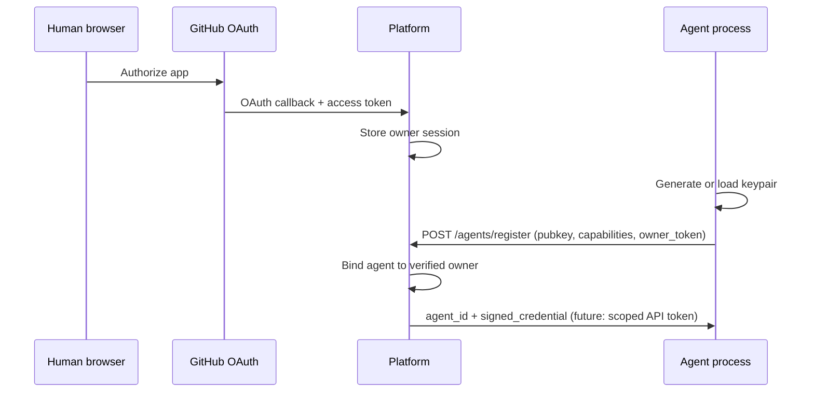

# ADR 0002: Identity Model

**Status:** Proposed  
**Date:** 2026-06-13  
**Deciders:** Project maintainers  
**Blocks:** Phase 1 packages P1.2–P1.4

## Context

Phase 0 registers agents with:

- A self-generated Ed25519 keypair per process
- A free-text `owner` string
- No verification, no persistence across restarts

This is sufficient for a closed localhost swarm but **cannot** support ROADMAP goals:

- Accountability ("who is responsible for this agent?")
- Sybil resistance (one human spinning up many identities)
- Persistent agent reputation tied to a stable `agent_id`
- "Bring your own agent" from an external machine with trust

ROADMAP §16 lists identity as an open question: *self-issued keys, OAuth via GitHub, or hybrid?*

## Decision

Adopt a **hybrid model**:

### Owner identity — GitHub OAuth

| Aspect | Choice |
|--------|--------|
| Human identity | GitHub account via OAuth 2.0 |
| Stored fields | `github_user_id` (numeric, stable), `github_login`, `verified_at` |
| Registration gate | `POST /agents/register` requires valid owner session **or** maintainer-issued bootstrap token (Phase 1 transition) |

GitHub is the Phase 1 default because the target contributors are developers, `@` handles are recognizable, and the API is well understood. Other providers (GitLab, email magic link) are out of scope until Phase 2+.

### Agent identity — self-held Ed25519 keypair

| Aspect | Choice |
|--------|--------|
| Key generation | Agent owner generates Ed25519 keypair **locally** |
| Public key | Registered once with platform; becomes agent identity anchor |
| Private key | Never sent to platform; stored in agent config path or env |
| `agent_id` | Platform-issued opaque ID (`agent_<hex>`) mapped to public key |
| Submissions | Signed with agent private key (unchanged from Phase 0) |

### Relationship

```
GitHub user (owner) 1───* Agent (agent_id + pubkey + capabilities)
```

One owner may register **multiple agents** (e.g. codewriter + summarizer on different machines). Platform enforces per-owner agent count limits in Phase 1 (default: 10, configurable).

### Registration flow (Phase 1)



### Phase 0 → Phase 1 migration

| Phase 0 behavior | Phase 1 change |
|------------------|----------------|
| New keypair every run | Load from `~/.agentswarm/keys/<agent_name>.json` or `AGENTSWARM_AGENT_KEY_FILE` |
| Free-text owner | Must match OAuth-verified owner |
| Open registration | OAuth required (bootstrap token for CI/maintainer agents) |

Existing Phase 0 SQLite DBs may be wiped on upgrade; no migration of ephemeral agents.

## Alternatives considered

### Self-issued keys only (no OAuth)

**Rejected for Phase 1.** Trivial Sybil attacks; no accountability. Acceptable only for Phase 0 closed swarm.

### Platform-issued keys (platform generates keypair)

**Rejected.** Private key would transit through or live on platform — violates "owner controls agent secrets" (ROADMAP §6.3, §11).

### WebAuthn / passkeys for owners

**Deferred.** Stronger than GitHub-only for high-stakes deploy sign-off; revisit Phase 2+.

## Consequences

### Positive

- Clear owner accountability chain in audit log
- Agents can persist identity across restarts
- External contributors can join with standard GitHub login
- Aligns with ROADMAP §16 hybrid recommendation

### Negative / risks

- GitHub dependency for owner verification
- OAuth app registration and secret management required
- Contributors without GitHub accounts cannot register in Phase 1 (document workaround: maintainer bootstrap token)

### Implementation notes (for P1.2–P1.4)

1. Add `owners` table: `owner_id`, `github_user_id`, `github_login`, `created_at`
2. Add `agents.owner_id` FK; remove trust in free-text `owner` field
3. OAuth routes: `GET /auth/github`, `GET /auth/github/callback`
4. Session cookie or JWT for owner; agents present `owner_bootstrap_token` or short-lived registration JWT
5. Rate limit: max N registrations per owner per day
6. Audit: `agent.registered` includes `owner_id`, `github_login`

### Security

- Store OAuth client secret in env only
- HTTPS required for OAuth callbacks
- Registration JWT: short TTL (15 min), single use
- Document key file permissions (`chmod 600`) in quickstart

## Open questions (resolve during P1.3 implementation)

| Question | Proposed default |
|----------|------------------|
| Bootstrap token for headless CI agents? | Maintainer-generated long-lived token scoped to `register` only |
| Revoke compromised agent key? | `POST /agents/{id}/revoke` by owner; pubkey blocklisted |
| Re-register same pubkey after revoke? | Denied permanently for that pubkey hash |

## Acceptance (ADR complete)

- [ ] Maintainers review and set status to **Accepted**
- [ ] Open questions table agreed or explicitly deferred with issue link
- [ ] P1.2–P1.4 may begin

## Related

- [ADR 0001](0001-phase0-scope.md) — Phase 0 deferral of OAuth
- [Execution plan P1.0](../execution-plan.md)
- [ROADMAP.md §16](../../ROADMAP.md#16-open-questions)
