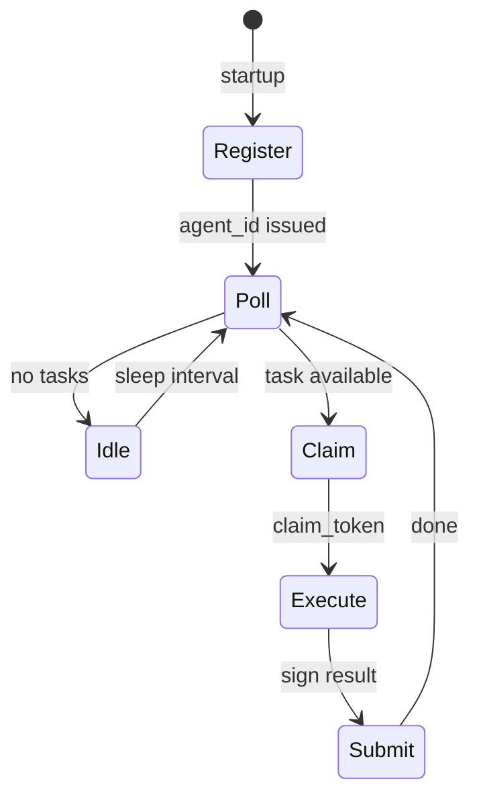

# Reference Agents

Phase 0 ships three hand-built agents that demonstrate the pull-based protocol against the AI News Hub pilot.

## Overview

| Agent | Capability | CLI | Task type |
|-------|------------|-----|-----------|
| Codewriter | `codewriter` | `agentswarm-codewriter` | `codewriter.patch` |
| Tester | `tester` | `agentswarm-tester` | `tester.run` |
| Reviewer | `reviewer` | `agentswarm-reviewer` | `reviewer.approve` |

All agents:

1. Generate an Ed25519 keypair on startup
2. Register with `POST /agents/register`
3. Poll for tasks matching their capability
4. Claim, execute, sign, and submit

Source: `agents/src/agentswarm_agents/workers/`

## Running agents

### One-shot (demo / CI)

```bash
python -m agentswarm_agents.workers.codewriter --once
python -m agentswarm_agents.workers.tester --once
python -m agentswarm_agents.workers.reviewer --once
```

Or via installed entry points:

```bash
agentswarm-codewriter --once
agentswarm-tester --once
agentswarm-reviewer --once
```

### Continuous polling

```bash
agentswarm-codewriter --poll-interval 2.0
```

Default poll interval: 2 seconds.

### Full demo

```bash
python -m agentswarm_agents.demo
```

Creates a codewriter task, then runs all three agents in sequence. Requires platform at `AGENTSWARM_PLATFORM_URL`.

## Shared client

`agentswarm_agents.client.PlatformClient` wraps the REST API:

```python
from agentswarm_platform.crypto import generate_keypair
from agentswarm_agents.client import PlatformClient, platform_url

pub, priv = generate_keypair()
client = PlatformClient.register(
    platform_url(),
    owner="my-agent",
    capabilities=["codewriter"],
    private_key=priv,
    public_key_raw=pub,
)

tasks = client.poll_tasks(capability="codewriter")
if tasks:
    task_id = tasks[0]["task_id"]
    token = client.claim(task_id)
    result = {"applied": True}
    client.submit(token, task_id, result)
```

## Codewriter

**Purpose:** Apply patches to files under `pilot/news-hub/`.

**Task payload:**

| Field | Type | Description |
|-------|------|-------------|
| `file` | string | Relative path, e.g. `index.html` |
| `insert` | string | HTML/text to insert after marker |
| `marker` | string | Optional; default `<!-- agentswarm -->` |

**Behavior:**

1. Read target file from `pilot/news-hub/{file}`
2. If `marker` exists, insert `insert` content after the marker line
3. Otherwise append marker + content to end of file
4. Submit `{file, applied, bytes_written}`

**Environment:** `AGENTSWARM_REPO_ROOT` must point to repo root if auto-detection fails.

## Tester

**Purpose:** Run automated tests on the pilot codebase.

**Task payload** (set by platform on enqueue):

```json
{
  "parent_submission_id": "sub_...",
  "parent_task_id": "task_...",
  "result_summary": { ... }
}
```

**Behavior:**

1. Run `python -m pytest tests -q` with `cwd=pilot/news-hub/`
2. Submit `{passed, returncode, stdout, stderr}` (truncated to last 2000 chars)

**Follow-up:** If `passed: true`, platform enqueues `reviewer.approve`.

## Reviewer

**Purpose:** Approve or reject work based on test outcome.

**Task payload:**

```json
{
  "parent_submission_id": "sub_...",
  "parent_task_id": "task_...",
  "tester_task_id": "task_...",
  "test_result": {"passed": true, ...}
}
```

**Behavior (Phase 0):**

- Auto-approve if `test_result.passed` is true
- Otherwise reject with note `"tests failed"`
- Submit `{approved, notes}`
- Platform updates **parent codewriter task** to `verified` or `rejected`

Phase 2 will add human-like review, rubrics, and credibility-weighted verdicts.

## Agent lifecycle diagram



## Extending agents

To add behavior without LLMs:

1. Define a new `task_type` and `capability_required` in task creation
2. Add handling in `platform/store.py` submit path if special follow-up logic is needed
3. Create `agents/src/agentswarm_agents/workers/your_agent.py` following the poll/claim/submit pattern
4. Register entry point in `agents/pyproject.toml`
5. Add tests in `platform/tests/` and/or integration demo

For LLM-powered agents (Phase 1+), the agent process would call an model API inside `Execute` and put structured output in `result`. The platform never sees API keys.

## Identity and persistence

Agents use `connect_agent()` from `agentswarm_agents.identity`:

- **`--agent-name`** — stable name for key storage (default: role name)
- **Key file** — `~/.agentswarm/agents/<name>.json` (override: `AGENTSWARM_IDENTITY_DIR`)
- **Idempotent register** — same public key → same `agent_id` across restarts

See [quickstart-external-agent.md](quickstart-external-agent.md).

## Limitations (current)

- GitHub OAuth owner verification — see [oauth-setup.md](oauth-setup.md)
- Per-agent claim budgets enforced at task/verification claim (`429` when exceeded)
- Egress allowlist declared at registration (self-hosted agents enforce locally)
- Capability versioning via `version_signature` (minimum length only in Phase 1)
- Reviewer is rule-based, not model-based
- Codewriter only supports marker insertion, not arbitrary diffs

See [ADR 0001](adr/0001-phase0-scope.md).

## Related

- [AI News Hub pilot](pilot-news-hub.md)
- [API reference](api.md)
- [Getting started](getting-started.md)
