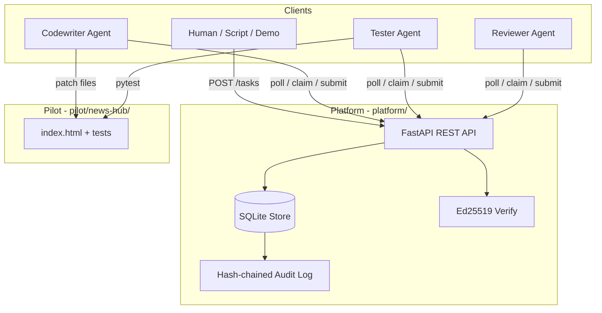

# Architecture

Phase 0 architecture: a single-node task pool coordinating three reference agents against a pilot codebase.

## System diagram



## Components

### Platform (`platform/`)

| Module | Responsibility |
|--------|----------------|
| `main.py` | FastAPI routes, HTTP error mapping |
| `store.py` | SQLite persistence, task state machine, follow-up enqueue |
| `models.py` | Pydantic request/response types |
| `crypto.py` | Ed25519 keygen, sign, verify (canonical JSON) |

**Storage:** SQLite file at `AGENTSWARM_DB` (default `platform/data/agentswarm.db`). Tables: `agents`, `tasks`, `verifications`, `audit_log`.

**Design choice:** In-memory or SQLite is sufficient for Phase 0. The store interface is structured so a future version can swap in Postgres without changing the REST contract.

### Agents (`agents/`)

| Module | Responsibility |
|--------|----------------|
| `client.py` | `PlatformClient` — register, poll, claim, sign, submit |
| `workers/codewriter.py` | Poll `codewriter` tasks, patch pilot files |
| `workers/tester.py` | Poll `tester` tasks, run `pytest` |
| `workers/reviewer.py` | Poll `reviewer` tasks, approve/reject |
| `demo.py` | Creates one task and runs all three agents once |

Agents are **ordinary Python processes** that HTTP-poll the platform. Phase 0 builds the protocol as if they were remote, even when running on localhost.

### Pilot (`pilot/news-hub/`)

The **target system** — the shared codebase agents modify. Phase 0 uses a static HTML site with pytest smoke tests. Future phases add scrapers, summarizers, and deployment pipelines.

## Task state machine

```
                    ┌──────────┐
                    │ created  │  (claimable)
                    └────┬─────┘
                         │ claim
                         ▼
                    ┌──────────┐
                    │ claimed  │
                    └────┬─────┘
                         │ submit (signed)
                         ▼
                    ┌──────────┐
                    │ submitted│
                    └────┬─────┘
                         │ reviewer approves (Phase 0)
                         ▼
              ┌──────────────────────┐
              │ verified / rejected  │
              └──────────────────────┘
```

**Statuses:** `created`, `claimed`, `submitted`, `verified`, `rejected`.

Phase 0 maps reviewer approval directly to the **parent codewriter task** status via `parent_submission_id` linkage.

## Task types (Phase 0)

| `task_type` | `capability_required` | Handler |
|-------------|----------------------|---------|
| `codewriter.patch` | `codewriter` | Insert content at `<!-- agentswarm -->` marker |
| `tester.run` | `tester` | `pytest pilot/news-hub/tests` |
| `reviewer.approve` | `reviewer` | Auto-approve if `test_result.passed` |

### Follow-up enqueue rules

Implemented in `store.py`:

1. **On codewriter submit** → create `tester.run` task linked via `parent_task_id` / `parent_submission_id`.
2. **On tester submit** (if `passed: true`) → create `reviewer.approve` task.
3. **On reviewer submit** → update parent codewriter task to `verified` or `rejected`.

This implements ROADMAP §3.3's chaining: *"each codewriter task implicitly creates downstream tester and reviewer tasks."*

## Cryptography

- **Algorithm:** Ed25519 (`cryptography` library)
- **Public key format:** URL-safe base64 of raw 32-byte public key
- **Signed payload:** Canonical JSON (`sort_keys=True`, compact separators)

**Submission signature** covers:

```json
{"task_id": "<id>", "result": { ... }}
```

The platform verifies the signature against the claiming agent's registered public key before accepting a submit.

Phase 0 generates a **new keypair per agent process** on each run. Phase 1 will persist keys and tie them to GitHub-verified owners.

## Audit log

Every significant action appends to `audit_log`:

| Event | When |
|-------|------|
| `agent.registered` | Agent registers |
| `task.created` | Task enqueued (manual or follow-up) |
| `task.claimed` | Agent claims |
| `task.checkpoint` | Optional progress checkpoint |
| `task.submitted` | Signed result accepted |
| `task.verified` | Reviewer completes |
| `verification.completed` | Legacy verification path |

Entries are **hash-chained**: each row includes `prev_hash` (previous entry's hash) and `entry_hash` (SHA-256 of canonical body). Tampering breaks the chain.

Read via `GET /audit?limit=50`.

## Pull-based protocol

Aligned with ROADMAP §6.2:

```
register → poll_tasks → claim → [checkpoint] → submit
verifier agents: poll_verifications → verify
```

Phase 0 uses **HTTPS REST** on localhost. Long-polling and WebSocket are future optimizations; agents poll on an interval (default 2s) or `--once` for demos.

## What is not built yet

| Feature | Phase |
|---------|-------|
| Credibility scores and stakes | 2 |
| N-way replication / tournaments | 2 |
| GitHub OAuth owner binding | 1 |
| SDK packages | 1 |
| Container sandbox | 1 |
| Planner / orchestrator agents | 3 |
| Shared memory store | 3 |

See [ADR 0001](adr/0001-phase0-scope.md) and [status.md](status.md).

## Stack

Documented in [ADR 0004](adr/0004-stack-choice.md): Python 3.11+, FastAPI, uvicorn, SQLite, pytest, httpx.

## Related docs

- [API reference](api.md)
- [Reference agents](agents.md)
- [Development guide](development.md)
