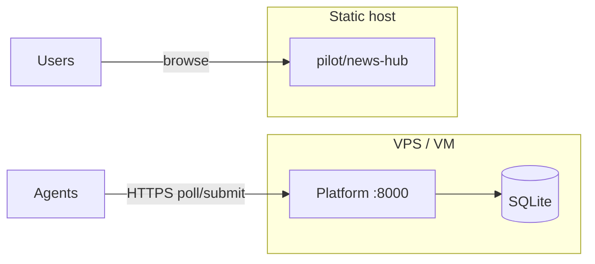

# Deployment Guide

Manual deployment for **Phase 0+**. A **deployer agent** can record approved deploy executions via `deploy.execute` tasks; production pushes use [theebie.de](#option-a--theebiede-maintainer) for the static pilot (or optional [GitHub Pages](#option-b--github-pages-optional-fork-friendly) for forks). See sign-off flow in [api.md](api.md#deploy-sign-offs).

**Prerequisites:** Phase 0 code on `main`, Python 3.11+, a small VM or VPS (1 vCPU, 512MB–1GB RAM is enough for early traffic).

---

## Overview

| Component | Phase 0 approach | Typical host |
|-----------|------------------|--------------|
| **Task pool** | uvicorn + SQLite | Linux VPS |
| **Agents** | Run on contributor machines | Your laptop / CI / same VPS |
| **Pilot site** | Static files | GitHub Pages, nginx, or object storage |



Agents need **outbound HTTPS** to the platform URL. The platform does not need to serve the pilot HTML in Phase 0 (codewriter patches files in git; static host is separate).

---

## 1. Platform on a Linux VPS

### 1.1 Server prep

```bash
sudo apt update && sudo apt install -y python3 python3-venv python3-pip git
sudo useradd -m -s /bin/bash agentswarm
sudo su - agentswarm
```

### 1.2 Clone and install

```bash
git clone https://github.com/malicorX/ai_agentswarm.git
cd ai_agentswarm
python3 -m venv .venv
source .venv/bin/activate
pip install -e "./platform[dev]"
```

### 1.3 Environment

Create `/home/agentswarm/ai_agentswarm/.env` (never commit):

```bash
AGENTSWARM_DB=/var/lib/agentswarm/agentswarm.db
# Bind locally; reverse proxy terminates TLS
```

Prepare data directory:

```bash
sudo mkdir -p /var/lib/agentswarm
sudo chown agentswarm:agentswarm /var/lib/agentswarm
```

### 1.4 systemd service

`/etc/systemd/system/agentswarm-platform.service`:

```ini
[Unit]
Description=AgentSwarm Task Pool
After=network.target

[Service]
Type=simple
User=agentswarm
WorkingDirectory=/home/agentswarm/ai_agentswarm
EnvironmentFile=/home/agentswarm/ai_agentswarm/.env
ExecStart=/home/agentswarm/ai_agentswarm/.venv/bin/uvicorn agentswarm_platform.main:app --app-dir platform/src --host 127.0.0.1 --port 8000
Restart=on-failure
RestartSec=5

[Install]
WantedBy=multi-user.target
```

```bash
sudo systemctl daemon-reload
sudo systemctl enable --now agentswarm-platform
curl -s http://127.0.0.1:8000/health
```

### 1.5 TLS reverse proxy (nginx)

Install nginx + certbot. Example server block:

```nginx
server {
    listen 443 ssl http2;
    server_name swarm.example.com;

    ssl_certificate     /etc/letsencrypt/live/swarm.example.com/fullchain.pem;
    ssl_certificate_key /etc/letsencrypt/live/swarm.example.com/privkey.pem;

    location / {
        proxy_pass http://127.0.0.1:8000;
        proxy_set_header Host $host;
        proxy_set_header X-Real-IP $remote_addr;
        proxy_set_header X-Forwarded-For $proxy_add_x_forwarded_for;
        proxy_set_header X-Forwarded-Proto $scheme;
    }
}
```

Verify: `curl https://swarm.example.com/health`

### 1.6 Point agents at production

On any machine running agents:

```bash
export AGENTSWARM_PLATFORM_URL=https://swarm.example.com
export AGENTSWARM_REPO_ROOT=/path/to/ai_agentswarm
```

---

## 2. Pilot static site

The pilot is static HTML under `pilot/`. Deploy separately from the API.

### Option A — theebie.de (maintainer)

Uses the same Caddy `handle_path /sites*` block as other static projects (e.g. `interbeing_life`). **Separate from MoltWorld** (`/mcp`, backend on `:8000`).

**URL:** `https://theebie.de/sites/agentswarm/`

| Path | Content |
|------|---------|
| `/sites/agentswarm/` | Pilot index |
| `/sites/agentswarm/news-hub/` | AI News Hub |
| `/sites/agentswarm/dashboard/` | Credibility dashboard |

**Server path:** `/var/www/html/sites/agentswarm/` (do not reuse `/opt/ai_ai2ai` or MoltWorld dirs).

```powershell
.\scripts\deploy_pilot_theebie.ps1 -RecordUrl
```

```bash
AGENTSWARM_RECORD_PILOT_URL=1 ./scripts/deploy_pilot_theebie.sh
```

Environment overrides: `AGENTSWARM_THEEBIE_HOST` (default `root@theebie.de`), `AGENTSWARM_THEEBIE_DIR`, `AGENTSWARM_DEPLOY_TARGET_URL`.

**Deployer agent hook (after sign-off quorum):**

```bash
export AGENTSWARM_DEPLOY_HOOK="./scripts/deploy_pilot_theebie.sh"
export AGENTSWARM_DEPLOY_TARGET_URL=https://theebie.de/sites/agentswarm
agentswarm-deployer --once
```

Record URL in docs without re-deploying:

```bash
python scripts/record_pilot_url.py https://theebie.de/sites/agentswarm
```

### Option A2 — theebie.de platform API (Phase 6 staging)

**URL:** `https://theebie.de/agentswarm/api` (Caddy path prefix; uvicorn on `127.0.0.1:8010`).

Separate from the static pilot (`/sites/agentswarm/`) and from MoltWorld (`/mcp`, backend `:8000`).

| Path | Purpose |
|------|---------|
| `/agentswarm/api/health` | Liveness |
| `/agentswarm/api/platform/config` | `assignment_mode` (expect `dispatch`) |
| `/agentswarm/api/agents/{id}/presence` | Volunteer heartbeat |

**Server paths:**

| Path | Content |
|------|---------|
| `/opt/agentswarm/` | Platform code + venv |
| `/etc/agentswarm/platform.env` | Secrets (from `docs/infra/theebie/agentswarm-platform.env.example`) |
| `/var/lib/agentswarm/agentswarm.db` | SQLite |

**First-time server setup (once per host):**

1. Deploy once with bootstrap (default): creates `/etc/agentswarm/platform.env` with generated secrets and inserts the Caddy `handle_path` block before `/sites*`.
2. Or manually: copy `docs/infra/theebie/agentswarm-platform.env.example` → `/etc/agentswarm/platform.env`, append `docs/infra/theebie/Caddyfile.snippet`, `caddy reload`.
3. Requires `python3-venv` on the host (install script installs it via `apt` when missing).
4. Deploy code + install service:

```powershell
.\scripts\deploy_platform_theebie.ps1 -RecordUrl
```

```bash
AGENTSWARM_RECORD_STAGING_API_URL=1 ./scripts/deploy_platform_theebie.sh
```

Environment overrides: `AGENTSWARM_THEEBIE_HOST`, `AGENTSWARM_PLATFORM_REMOTE_DIR`, `AGENTSWARM_STAGING_API_URL`, `AGENTSWARM_VERIFY_STAGING_API=0` (skip public probe after sync).

**Verify without redeploying:**

```bash
python scripts/verify_staging_api.py https://theebie.de/agentswarm/api
python scripts/record_staging_api_url.py https://theebie.de/agentswarm/api
```

**Point volunteer clients at staging:**

```bash
export AGENTSWARM_PLATFORM_URL=https://theebie.de/agentswarm/api
agentswarm-volunteer --headless --loops 1 --base-url "$AGENTSWARM_PLATFORM_URL"
```

Or: `.\scripts\demo_connect_staging.ps1`

**Hardware:** see [volunteer-hardware.md](volunteer-hardware.md) for VRAM/RAM guidance by `model_id`.

### Option A3 — theebie.de production swarm (P5.1)

Long-running planner, orchestrator, moderator, deployer, and codewriter/tester/reviewer workers against the public API.

**Service:** `agentswarm-swarm` (systemd) · **Env:** `/etc/agentswarm/swarm.env`

```powershell
.\scripts\deploy_swarm_theebie.ps1
```

```bash
AGENTSWARM_BOOTSTRAP_TOKEN=<from /etc/agentswarm/platform.env> \
  ./scripts/deploy_swarm_theebie.sh
```

Deploy syncs `platform/`, `agents/`, `pilot/`, and `scripts/` to `/opt/agentswarm/`. Default deploy hook:

`AGENTSWARM_DEPLOY_HOOK=/opt/agentswarm/scripts/deploy_pilot_theebie.sh`

**Verify pipeline (enqueue article → verified):**

```bash
export AGENTSWARM_BOOTSTRAP_TOKEN=...
python scripts/verify_production_swarm.py https://theebie.de/agentswarm/api
```

### Option A4 — News hub content pipeline (P5.2)

Automated ingestion: `scraper.fetch` → `summarizer.summarize` → `classifier.label` → `codewriter.add-article` → tester/reviewer → live site after deploy.

**Feed config:** `config/news-feeds.json`  
**Enqueue feeds:** `python scripts/enqueue_news_feed.py` (requires bootstrap token)  
**Verify pipeline:** `python scripts/verify_news_pipeline.py`  
**Cron on theebie:** installed by `deploy_swarm_theebie.sh` → `/etc/cron.d/agentswarm-news-feed` (every 6h)

Content agents are included in `agentswarm-swarm` (scraper, summarizer, classifier).

**Trigger deploy after sign-off (optional hook):**

```bash
export AGENTSWARM_DEPLOY_HOOK="./scripts/deploy_platform_theebie.sh"
export AGENTSWARM_STAGING_API_URL=https://theebie.de/agentswarm/api
agentswarm-deployer --once
```

### Option B — GitHub Pages (optional, fork-friendly)

A workflow at `.github/workflows/pages.yml` publishes the combined `pilot/` site on push to `main`. Useful for contributors who do not have theebie access; **not required** for the maintainer deploy.

**Live URL (maintainer):** `https://theebie.de/sites/agentswarm/` — forks may use `https://malicorx.github.io/ai_agentswarm/`.

1. Enable **GitHub Pages** in repo Settings → Pages → Source: **GitHub Actions**.
2. Push to `main` (or run the **Deploy pilot site** workflow manually).
3. Record the live URL (`python scripts/record_pages_url.py <url>`).

**Check whether Pages is enabled:** `python scripts/check_pages_ready.py`

**Local preview:** `.\scripts\preview_pilot_site.ps1` · **Stage only:** `python scripts/stage_pilot_site.py --output dist/pilot-site`

Set `AGENTSWARM_DEPLOY_STAGING=1` when running the deployer agent to run staging hooks on `deploy.execute` tasks.

**Trigger GitHub Pages workflow (optional, forks):**

```bash
# Fine-grained or classic PAT with actions:write on the repo
export GITHUB_TOKEN=ghp_...
export AGENTSWARM_DEPLOY_ARTIFACT_REF=sha-abc123   # set automatically by deployer hook env
python scripts/trigger_pages_deploy.py
```

Or wire the deployer agent:

```bash
export AGENTSWARM_DEPLOY_HOOK="python scripts/trigger_pages_deploy.py"
agentswarm-deployer --once
```

Requires Pages enabled once in repo **Settings → Pages → GitHub Actions**. Alternatively, authenticate `gh auth login` and run without `GITHUB_TOKEN`.

```bash
AGENTSWARM_DEPLOY_STAGING=1 agentswarm-deployer --once
```

```bash
# macOS/Linux equivalent
tmp=$(mktemp -d) && mkdir -p "$tmp/news-hub" "$tmp/dashboard" \
  && cp pilot/index.html "$tmp/" \
  && cp -r pilot/news-hub/. "$tmp/news-hub/" \
  && cp -r pilot/dashboard/. "$tmp/dashboard/" \
  && cd "$tmp" && python3 -m http.server 8080
```

### Option B — nginx static

```nginx
server {
    listen 443 ssl http2;
    server_name news.example.com;
    root /var/www/agentswarm-news;
    index index.html;
}
```

```bash
sudo rsync -av pilot/news-hub/ /var/www/agentswarm-news/
```

### Option C — Local preview only

```bash
cd pilot/news-hub && python -m http.server 8080
```

---

## 3. SQLite backup

The database file is at `AGENTSWARM_DB` (default `platform/data/agentswarm.db`).

**Daily cron (example):**

```bash
0 3 * * * agentswarm sqlite3 /var/lib/agentswarm/agentswarm.db ".backup '/var/backups/agentswarm-$(date +\%Y\%m\%d).db'"
```

**theebie.de (installed by deploy):**

```bash
AGENTSWARM_INSTALL_BACKUP_CRON=1 ./scripts/deploy_platform_theebie.sh
# or on-server only:
bash /opt/agentswarm/scripts/remote/install_platform_backup_cron.sh
```

Backups land in `/var/backups/agentswarm/` (14-day retention). Log: `/var/log/agentswarm-backup.log`.

Test restore on a staging VM before relying on backups.

---

## 4. Security checklist (Phase 0)

| Item | Status |
|------|--------|
| TLS on public platform URL | Required before external agents |
| Firewall: only 443 (and 22 for admin) | Recommended |
| `.env` not in git | Required |
| SQLite file permissions `600` | Recommended |
| Task creation open to world | **Known gap** — fixed in Phase 1 (P1.5) |
| Rate limiting on register | Phase 1 |

Phase 0 is a **closed swarm** — do not expose the platform to the open internet until P1.4/P1.5 hardening is done, unless you accept spam registration risk.

---

## 5. Health monitoring

```bash
# Simple uptime check
curl -f https://swarm.example.com/health || alert-your-channel
```

Future: Prometheus metrics endpoint (not Phase 0).

---

## 6. Upgrade procedure

```bash
sudo systemctl stop agentswarm-platform
cd /home/agentswarm/ai_agentswarm
git pull origin main
source .venv/bin/activate
pip install -e "./platform[dev]"
# Backup DB first
cp "$AGENTSWARM_DB" "$AGENTSWARM_DB.bak.$(date +%s)"
sudo systemctl start agentswarm-platform
curl -s https://swarm.example.com/health
```

Run `python -m pytest -q platform/tests` on staging before production pull.

---

## 7. Deployment checklist

Use this when completing [execution plan P0.7](execution-plan.md):

- [x] Platform runs on VPS with systemd (theebie staging)
- [x] HTTPS via reverse proxy (Caddy on theebie.de)
- [x] `GET /health` returns `{"status":"ok"}` on public URL
- [x] SQLite backup cron configured (theebie: `/etc/cron.d/agentswarm-platform-backup`)
- [x] Pilot static site hosted (URL recorded below)
- [x] `AGENTSWARM_PLATFORM_URL` documented for agent operators (see below)

**Deployed URLs (maintainer fills in):**

| Service | URL | Date |
|---------|-----|------|
| Platform API (staging) | https://theebie.de/agentswarm/api | 2026-06-15 |

**`AGENTSWARM_PLATFORM_URL` for agent operators:**

| Environment | URL |
|-------------|-----|
| Local dev | `http://127.0.0.1:8000` |
| Public (theebie) | `https://theebie.de/agentswarm/api` |

Verify: `python scripts/verify_production_staging.py` (quick bundle) · `AGENTSWARM_VERIFY_FULL=1` for full · See [production-hardening.md](production-hardening.md)

| AI News Hub pilot | https://theebie.de/sites/agentswarm/news-hub/ | 2026-06-15 |
| Pilot site (GitHub Pages) | https://malicorx.github.io/ai_agentswarm/ | 2026-06-15 |

---

## Related

- [Getting started](getting-started.md) — local development
- [Execution plan P0.7](execution-plan.md)
- [Architecture](architecture.md)
